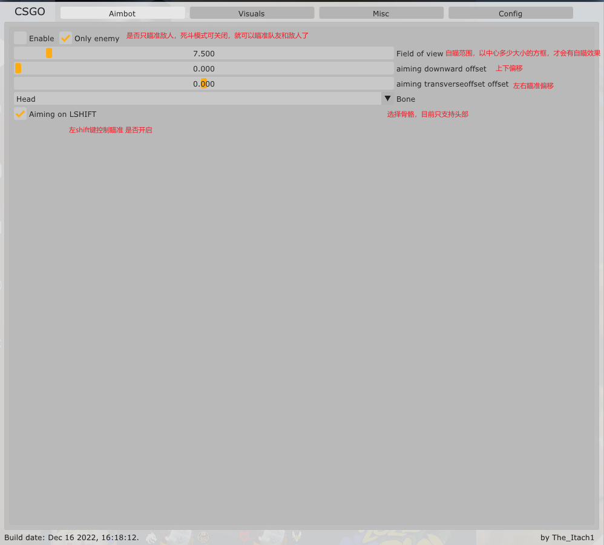
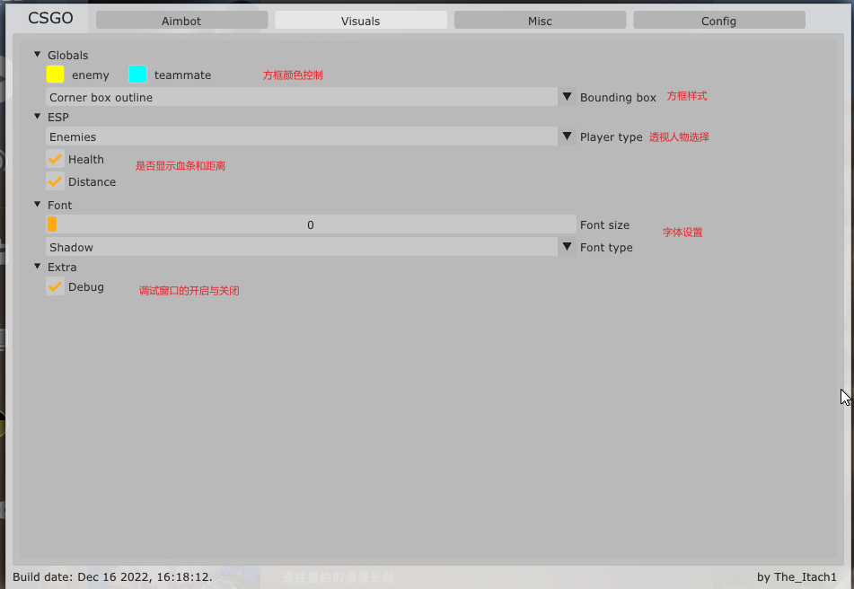

# CsgoHacker

小孩子不懂事写着玩的，自己更新偏移，只做学习用途，只要敢用，必被封。

整体框架比较完善，界面也比较好看，感觉还不错。

## 开发

direct9 hook + imgui + c++

怎么写

- direct9 hook
- 学读写目标进程的内存
- 透视原理，自瞄原理，也就是世界坐标，屏幕坐标那些东西。
- 抄+改，抄别人的，改成自己的。

## 使用方法

- 打开csgo游戏
- 等游戏界面载入后，打开injector for csgo.exe，输入CsgoHacker.dll，回车。
- 出现imgui的界面，就成功了。
- home键控制imgui窗口的开关

## 功能

- 方框透视，队友和敌人都可透视，可自定义方框样式，方框颜色，方框左侧有血条栏，血条方向自己可选。
- 自瞄，锁头，左键射击时自动开启，长按左shift键也是开启自瞄。
- 尝试获取身体的骨骼部分，可实现部分身体部位自瞄。(以完成)
- 发光透视。(以完成)

## imgui界面

老图片，未更新图片。

### amibot

这个界面主要控制自瞄功能，目前只能锁头，但我设置了上下偏移和左右偏移，使其可以瞄准其他部位，但始终没有锁骨骼好用。

### Visuals

透视相关的设置

## 注意事项

- 偶尔会引发崩溃，比较少，想确认原因自己使用windbg看崩溃的堆栈信息吧。
- 偶尔会出现视角无法转动的情况，需要重启游戏。
- 锁头很暴力，开了容易被举报，透视还好，特别是休闲模式会被观战。
- 强烈建议淘宝2元买个小号自己玩玩，因为被举报大概率会被封

## 后续开发

- 尝试获取身体的骨骼部分。(以完成)
- 发光透视。(以完成)
- 血条方向可选。(以完成)
